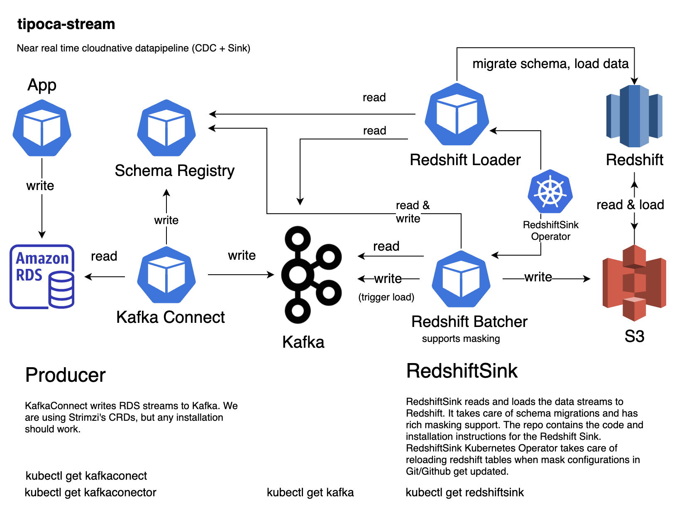

# tipoca-stream

---

Near real time data pipeline. Just another data pipeline.

## Thanks

- [Debezium](https://debezium.io/).
- Yelp for open-sourcing the [the blog](https://engineeringblog.yelp.com/2016/10/redshift-connector.html) on the redshift connector.
- Confluent for open-sourcing [Kafka Connect](https://docs.confluent.io/current/connect/index.html) and [Kafka Schema registry](https://github.com/confluentinc/schema-registry).
- Linkedin for open-sourcing [goavro](https://github.com/linkedin/goavro).
- Linkedin for donating [Kafka](https://kafka.apache.org).
- Shopify for open-sourcing [sarama](https://github.com/Shopify/sarama).
- Thockin for open-sourcing [go-build-template](https://github.com/thockin/go-build-template).
- Clever for open-sourcing [s3-to-redshift library](https://github.com/Clever/s3-to-redshift/).
- herryg91 for open-sourcing [go batch libray](https://github.com/herryg91/gobatch).
