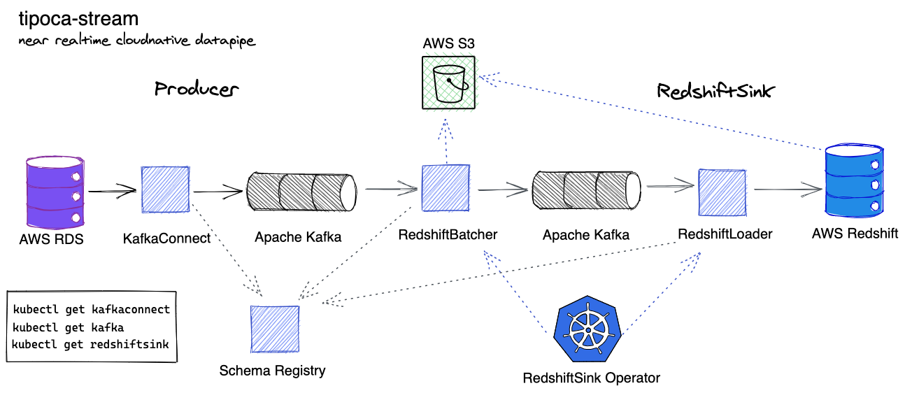

# tipoca-stream
[](https://travis-ci.com/practo/tipoca-stream)



---

Near realtime cloud native data pipeline. Just another data pipeline.

## Install
The pipeline is a combination of services deployed independently. This repo holds the code for the redshiftsink only.

- **RedshiftSink** Please follow [REDSHIFTSINK.md](https://github.com/practo/tipoca-stream/blob/master/REDSHIFTSINK.md) to install the RedshiftSink Kubernetes Operator. Creating the RedshiftSink resource installs Batcher and Loader pods in the cluster. These pods sinks the data from Kafka topics to Redshift, it takes care of the database migration when required. Redshiftsink has a rich [masking](https://github.com/practo/tipoca-stream/blob/master/MASKING.md) support. It also supports table reloads in Redshift when masking configurations are modified in Github.
```
      kubectl get redshiftsink
```

- **Kafka** Install Kafka using [Strimzi](http://strimzi.io/) CRDs or self hosted or managed kafka.
```
      kubectl get kafka
```

- **Producer** Install Producer using [Strimzi](http://strimzi.io/) CRDs and [Debezium](https://debezium.io/). Creating the kafkaconnect and kafkaconnector creates a kafkaconnect pod in the cluster which start streaming the data from the source(MYSQL, RDS, etc..) to Kafka.
```
      kubectl get kafkaconnect
      kubectl get kafkaconnector
```

The project has pluggable libraries which can be composed to solve any other data pipeline use case.

## Contribute
Please follow [this](https://github.com/practo/tipoca-stream/blob/master/REDSHIFTSINK.md#contributing) to bring a change.

## Thanks

- [Debezium](https://debezium.io/).
- [Strimzi.io](http://strimzi.io/) for the Kafka CRDs.
- Yelp for open-sourcing the [the blog](https://engineeringblog.yelp.com/2016/10/redshift-connector.html) on the redshift connector.
- Linkedin for open-sourcing [goavro](https://github.com/linkedin/goavro).
- Linkedin for donating [Kafka](https://kafka.apache.org).
- Shopify for open-sourcing [sarama](https://github.com/Shopify/sarama).
- Thockin for open-sourcing [go-build-template](https://github.com/thockin/go-build-template).
- Clever for open-sourcing [s3-to-redshift library](https://github.com/Clever/s3-to-redshift/).
- danielqsj for [kafka-exporter](https://github.com/danielqsj/kafka_exporter).
