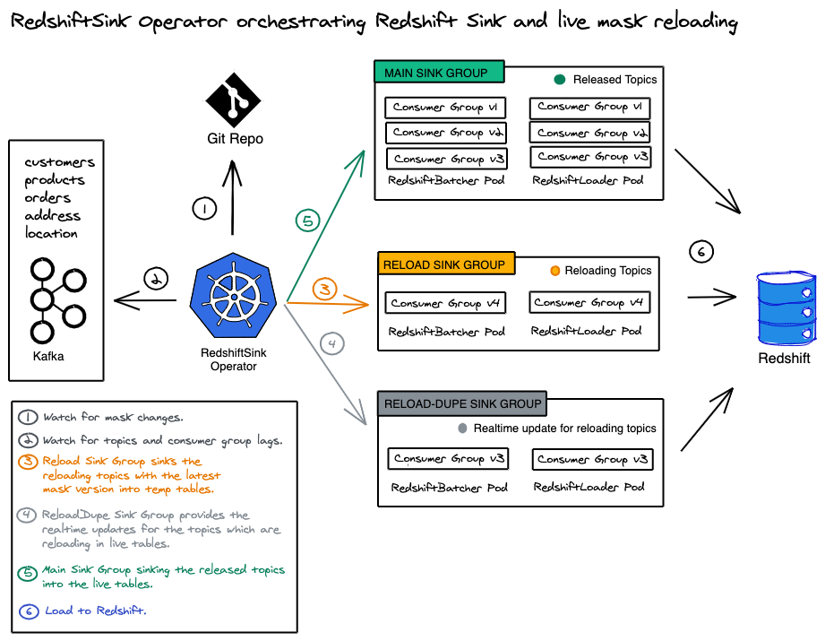
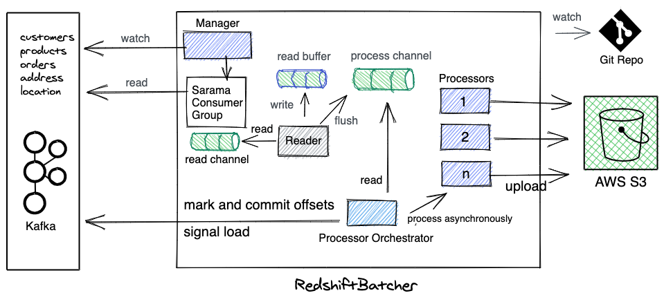
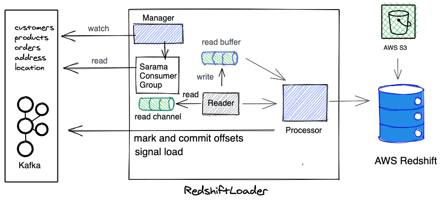

# RedshiftSink

RedshiftSink reads the data events from Kafka and loads them to Redshift. It supports [masking](./MASKING.MD).

# Install Redshiftsink

* Add the secrets in a file for Redshift, Git, MaskSalt, S3, etc...
```bash
cp config/operator/kustomization_sample.yaml config/operator/kustomization.yaml
vim config/operator/kustomization.yaml #fill in ur secrets
```

* Generate manifests using `kustomize`, verify the manifests and apply them. This will install the RedshiftSink operator, Kubernetes Secrets and the RBAC configuration in the Kubernetes cluster.
```bash
cd config/default
kubectl kustomize . > manifest.yaml
kubectl apply -f manifest.yaml
```

or `make deploy`

### Verify Installation
Check the redshiftsink resource and the operator deployment is accessible using kubectl
```bash
kubectl get redshiftsink
kubectl get deploy | redshiftsink-operator
```

# Example

* Create the `Redshiftsink` resource. On creating it, the batcher and loader pods would be created which will start batching, masking and loading data to Redshift from Kafka topics.

```yaml
apiVersion: tipoca.k8s.practo.dev/v1
kind: RedshiftSink
metadata:
  name: inventory
spec:
  secretRefName: redshfitsink-secret-2bh89m59ct
  secretRefNamespace: kube-system
  kafkaBrokers: "kafka1.example.com,kafka2.example.com"
  kafkaTopicRegexes: "^db.inventory*"
  kafkaLoaderTopicPrefix: "loader-"
  releaseCondition:
    maxBatcherLag: 100
    maxLoaderLag: 10
  batcher:
    suspend: false
    mask: true
    maskFile: "github.com/practo/tipoca-stream/pkg/transformer/masker/database.yaml"
    sinkGroup:
        all:
          maxSizePerBatch: 10Mi
          maxWaitSeconds: 30
          maxConcurrency: 10
          deploymentUnit:
              podTemplate:
                resources:
                  requests:
                    cpu: 100m
                    memory: 200Mi
  loader:
    suspend: false
    redshiftSchema: "inventory"
    redshiftGroup:  "sales"
    sinkGroup:
        all:
          maxSizePerBatch: 1Gi
          maxWaitSeconds: 30
          maxProcessingTime: 60000
          deploymentUnit:
              podTemplate:
                resources:
                  requests:
                    cpu: 100m
                    memory: 200Mi

```

```bash
kubectl create -f config/samples/tipoca_v1_redshiftsink.yaml
```
This will start syncing all the Kakfa topics matching regex `"^db.inventory*"` from Kafka to Redshift via S3. If masking is turned on it will also mask the data. More on masking [here.](./MASKING.md)

----



----

## RedshiftSink Managed Pods
Redshiftsink performs the sink by creating two pods. Creating a RedshiftSink CRD installs the batcher and loader pods. Batcher and loader pods details are below:

### Redshift Batcher
- Batches the debezium data in Kafka topics and uploads to S3.
- Signals the Redshift loader to load the batch in Redshift using Kafka Topics.
- **Batcher supports masking the data**. Please follow [this for enabling masking](./MASKING.md).



```bash
$ bin/darwin_amd64/redshiftbatcher --help
Consumes the Kafka Topics, trasnform them for redshfit, batches them and uploads to s3. Also signals the load of the batch on successful batch and upload operation..

Usage:
  redshiftbatcher [flags]

Flags:
      --config string   config file (default "./cmd/redshiftbatcher/config/config.yaml")
  -h, --help            help for redshiftbatcher
  -v, --v Level         number for the log level verbosity

```

#### Metrics
```
rsk_batcher_bytes_processed_sum{consumergroup="", topic="", sinkGroup=""}
rsk_batcher_bytes_processed_sum{consumergroup="", topic="", sinkGroup=""}

rsk_batcher_messages_processed_count{consumergroup="", topic="", sinkGroup=""}
rsk_batcher_messages_processed_count{consumergroup="", topic="", sinkGroup=""}
```

The metrics are histograms in default buckets.

## Redshift Loader
- Loader performs schema migration.
- Loader performs the load of the data to Redshift by performing series of merge operations using Staging tables.



```bash
$ bin/darwin_amd64/redshiftloader --help
Loads the uploaded batch of debezium events to redshift.

Usage:
  redshiftloader [flags]

Flags:
      --config string   config file (default "./cmd/redshiftloader/config/config.yaml")
  -h, --help            help for redshiftloader
  -v, --v Level         number for the log level verbosity
```

#### Metrics
##### Histograms
```
rsk_loader_bytes_loaded_sum{consumergroup="", topic="", sinkGroup=""}
rsk_loader_bytes_loaded_sum{consumergroup="", topic="", sinkGroup=""}

rsk_loader_messages_loaded_sum{consumergroup="", topic="", sinkGroup=""}
rsk_loader_messages_loaded_sum{consumergroup="", topic="", sinkGroup=""}
```

```
rsk_loader_seconds_sum{consumergroup="", topic="", sinkGroup="", messages="", bytes=""}
rsk_loader_seconds_count{consumergroup="", topic="", sinkGroup="", messages="", bytes=""}

rsk_loader_copystage_seconds_sum{consumergroup="", topic="", sinkGroup="", messages="", bytes=""}
rsk_loader_copystage_seconds_count{consumergroup="", topic="", sinkGroup="", messages="", bytes=""}

rsk_loader_dedupe_seconds_sum{consumergroup="", topic="", sinkGroup="", messages="", bytes=""}
rsk_loader_dedupe_seconds_count{consumergroup="", topic="", sinkGroup="", messages="", bytes=""}

rsk_loader_deletecommon_seconds_sum{consumergroup="", topic="", sinkGroup="", messages="", bytes=""}
rsk_loader_deletecommon_seconds_count{consumergroup="", topic="", sinkGroup="", messages="", bytes=""}

rsk_loader_deleteop_seconds_sum{consumergroup="", topic="", sinkGroup="", messages="", bytes=""}
rsk_loader_copytarget_seconds_count{consumergroup="", topic="", sinkGroup="", messages="", bytes=""}
```
The metrics are histograms in buckets: `10, 30, 60, 120, 180, 240, 300, 480, 600, 900`

#### Gauge
```
rsk_loader_running{consumergroup="", topic="", sinkGroup="", messages="", bytes=""}
```

#### Counter
```
rsk_loader_throttled_total{consumergroup="", topic="", sinkGroup="", messages="", bytes=""}
```

## Contributing

* Generate CRD code and manifests.
```bash
make generate
make manifests
```

* Build
```bash
make build
binary: bin/darwin_amd64/redshiftbatcher
binary: bin/darwin_amd64/redshiftloader
binary: bin/darwin_amd64/redshiftsink
```

* Run the controller locally.
```bash
make run
```

### Enable Throttling (optional, recommended)
By default, throttling is disabled.

#### Why throttle?
By default there is no limit on the number of concurrent loads to Redshift. But if there are huge number of tables to be loaded and the number of concurrent loads become a bottleneck. This feature can be enabled to not run more than 10 table load at a time(not configurable at present). When this is enabled, all the tables above 10 are throttled for 15 seconds. This goes  on for about 3 minutes, and then the load is allowed. If Redshift Exporter is enabled then the throttling value for the table is determined by the table usage in Redshift. The exporter metrics helps in figuring out which tables are in use more.

#### How to enable?
- Export RedshiftLoader metrics to Prometheus.
```
kubectl create -f config/redshiftloader/service.yaml
kubectl create -f config/redshiftloader/servicemonitor.yaml
```

- Set `--prometheus-url` in the RedshiftSink Operator Deployment.
```
kubectl edit deploy -n kube-system redshiftsink-operator
```

### Enable RedshiftSink Exporter (optional, recommended)
By default the exporter is disabled. This feature will work only when Prometheus is enabled.

#### Why to export Redshift metrics to Prometheus?
We throttle the loads to keep the READ fast. Throttling logic by default treats all tables as same. But if the redshift exporter is enabled the only the less frequently used tables are throttled. This is helpful in reducing the load in Redshift and keeping the queries fast.

#### How to enable?
- Prerequisite: Enable Throttling (please see above).
- Create the below mentioned schema and view.
- Set `--collect-redshift-metrics` as true in the RedshiftSink Operator Deployment. `kubectl edit deploy -n kube-system redshiftsink-operator`

##### Create Schema
```sql
CREATE SCHEMA redshiftsink_operator;
```

##### Create View
Please change the below two in the SQL below, before running it to create the view. View [source](https://github.com/awslabs/amazon-redshift-utils/blob/184c2ba7fd9d497027a831ca72e08fe09e79fd0b/src/AdminViews/v_get_tbl_scan_frequency.sql)
1. `AND s.userid != 100` with the user id(s) of the redshiftsink user
2. `AND s.starttime > GETDATE() - interval '3 day'` with the time window you want to consider a table is in use or not.
3. Please create the following view for all the databases in Redshift you need. Then, add the list of these databases in the operator flag `--databases=`. This is required so that the operator queries the view for all the databases.

```sql
CREATE OR REPLACE VIEW redshiftsink_operator.scan_query_total AS
SELECT DATABASE,
       SCHEMA AS schemaname,
                 table_id as tableid,
                 "table" AS tablename,
                 SIZE,
                 sortkey1,
                 NVL(s.num_qs,0) query_total
FROM svv_table_info t
LEFT JOIN
  (SELECT tbl,
          perm_table_name,
          COUNT(DISTINCT query) num_qs
   FROM stl_scan s
   WHERE s.userid > 1
     AND s.userid != 100
     AND s.starttime > GETDATE() - interval '3 day'
     AND s.perm_table_name NOT IN ('Internal Worktable',
                                   'S3')
     AND s.perm_table_name NOT LIKE '%staged%'                                    
   GROUP BY tbl,
            perm_table_name) s ON s.tbl = t.table_id
AND t."schema" NOT IN ('pg_internal')
ORDER BY 7 DESC;
```
