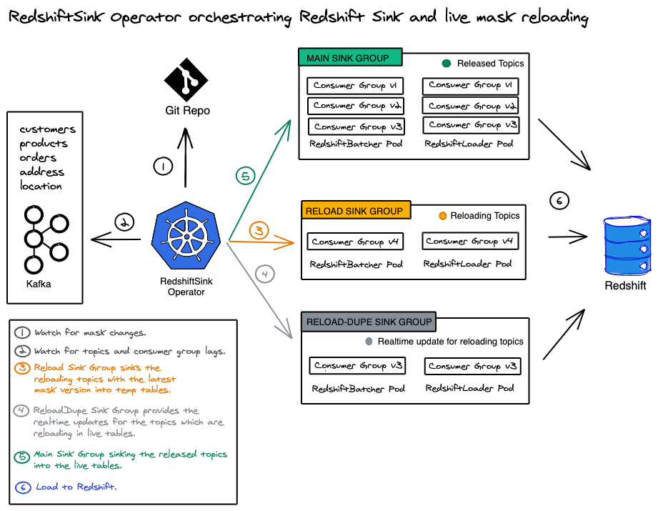

# RedshiftSink

RedshiftSink reads the debezium events from Kafka and loads them to Redshift. It has rich support for [masking](../MASKING.MD).

----



# Install Redshiftsink

* Add the secrets in a file.
```bash
cp config/operator/kustomization_sample.yaml config/operator/kustomization.yaml
vim config/operator/kustomization.yaml #fill in ur secrets
```

* Generate manifests, verify and install.
```bash
cd config/default
kubectl kustomize . > manifest.yaml
kubectl apply -f manifest.yaml
```

or `make deploy`

### Verify Installation
Check the redshiftsink resource is accessible using kubectl
```bash
kubectl get redshiftsink
kubectl get deploy | redshiftsink-operator
```

# Example

* Create the `Redshiftsink` custom resource. On creating it, the batcher and loader pods would be created which will start batching, masking and loading data to Redshift from Kafka topics.

```yaml
apiVersion: tipoca.k8s.practo.dev/v1
kind: RedshiftSink
metadata:
  name: inventory
spec:
  secretRefName: redshfitsink-secret-2bh89m59ct
  secretRefNamespace: kube-system
  kafkaBrokers: "kafka1.example.com,kafka2.example.com"
  kafkaTopicRegexes: "^db.inventory*"
  kafkaLoaderTopicPrefix: "loader-"
  releaseCondition:
    maxBatcherLag: 100
    maxLoaderLag: 10
  batcher:
    suspend: false
    mask: true
    maskFile: "github.com/practo/tipoca-stream/redshiftsink/pkg/transformer/masker/database.yaml"
    sinkGroup:
        all:
          maxSizePerBatch: 10Mi
          maxWaitSeconds: 30
          maxConcurrency: 10
          deploymentUnit:
              podTemplate:
                resources:
                  requests:
                    cpu: 100m
                    memory: 200Mi
  loader:
    suspend: false
    redshiftSchema: "inventory"
    redshiftGroup:  "sales"
    sinkGroup:
        all:
          maxSizePerBatch: 1Gi
          maxWaitSeconds: 30
          maxProcessingTime: 60000
          deploymentUnit:
              podTemplate:
                resources:
                  requests:
                    cpu: 100m
                    memory: 200Mi

```

```bash
kubectl create -f config/samples/tipoca_v1_redshiftsink.yaml
```

This will start syncing all the Kakfa topics matching regex `"^db.inventory*"` from Kafka to Redshift via S3. If masking is turned on it will also mask the data. More on masking [here](./MASKING.MD)

### Configuration

## RedshiftSink Managed Pods
Redshiftsink performs the sink by creating two pods. Creating a RedshiftSink CRD installs the batcher and loader pods. Batcher and loader pods details are below:

### Redshift Batcher
- Batches the debezium data in Kafka topics and uploads to S3.
- Signals the Redshift loader to load the batch in Redshift using Kafka Topics.
- **Batcher supports masking the data**. Please follow [this for enabling masking](https://github.com/practo/tipoca-stream/blob/master/redshiftsink/MASKING.md).


```bash
$ bin/darwin_amd64/redshiftbatcher --help
Consumes the Kafka Topics, trasnform them for redshfit, batches them and uploads to s3. Also signals the load of the batch on successful batch and upload operation..

Usage:
  redshiftbatcher [flags]

Flags:
      --config string   config file (default "./cmd/redshiftbatcher/config/config.yaml")
  -h, --help            help for redshiftbatcher
  -v, --v Level         number for the log level verbosity

```

#### Metrics
```
rsk_batcher_bytes_processed_sum{consumergroup="", topic="", sinkGroup=""}
rsk_batcher_bytes_processed_sum{consumergroup="", topic="", sinkGroup=""}

rsk_batcher_messages_processed_count{consumergroup="", topic="", sinkGroup=""}
rsk_batcher_messages_processed_count{consumergroup="", topic="", sinkGroup=""}
```

The metrics are histograms in default buckets.

### Configuration
Create a file config.yaml, refer [config-sample.yaml](./cmd/redshiftbatcher/config/config_sample.yaml).
```bash
cd cmd/redshiftbatcher/config/
cp config.sample.yaml config.yaml
```

## Redshift Loader


```bash
$ bin/darwin_amd64/redshiftloader --help
Loads the uploaded batch of debezium events to redshift.

Usage:
  redshiftloader [flags]

Flags:
      --config string   config file (default "./cmd/redshiftloader/config/config.yaml")
  -h, --help            help for redshiftloader
  -v, --v Level         number for the log level verbosity
```
- Loader performs schema migration.
- Loader performs the load of the data to Redshift by performing series of merge operations using Staging tables.

#### Metrics
```
rsk_loader_bytes_loaded_sum{consumergroup="", topic="", sinkGroup=""}
rsk_loader_bytes_loaded_sum{consumergroup="", topic="", sinkGroup=""}

rsk_loader_messages_loaded_sum{consumergroup="", topic="", sinkGroup=""}
rsk_loader_messages_loaded_sum{consumergroup="", topic="", sinkGroup=""}
```

```
rsk_loader_seconds_sum{consumergroup="", topic="", sinkGroup="", messages="", bytes=""}
rsk_loader_seconds_count{consumergroup="", topic="", sinkGroup="", messages="", bytes=""}

rsk_loader_copystage_seconds_sum{consumergroup="", topic="", sinkGroup="", messages="", bytes=""}
rsk_loader_copystage_seconds_count{consumergroup="", topic="", sinkGroup="", messages="", bytes=""}

rsk_loader_dedupe_seconds_sum{consumergroup="", topic="", sinkGroup="", messages="", bytes=""}
rsk_loader_dedupe_seconds_count{consumergroup="", topic="", sinkGroup="", messages="", bytes=""}

rsk_loader_deletecommon_seconds_sum{consumergroup="", topic="", sinkGroup="", messages="", bytes=""}
rsk_loader_deletecommon_seconds_count{consumergroup="", topic="", sinkGroup="", messages="", bytes=""}

rsk_loader_deleteop_seconds_sum{consumergroup="", topic="", sinkGroup="", messages="", bytes=""}
rsk_loader_copytarget_seconds_count{consumergroup="", topic="", sinkGroup="", messages="", bytes=""}
```

The metrics are histograms in buckets: `10, 30, 60, 120, 180, 240, 300, 480, 600, 900`

```
rsk_loader_running{consumergroup="", topic="", sinkGroup="", messages="", bytes=""}
```

### Configuration
Create a file config.yaml, refer [config-sample.yaml](./cmd/redshiftbatcher/config/config_sample.yaml).
```bash
cd cmd/redshiftbatcher/config/
cp config.sample.yaml config.yaml
```

## Contributing

* Generate CRD code and manifests.
```bash
make generate
make manifests
```

* Make changes and build code.
```bash
make build
binary: bin/darwin_amd64/redshiftbatcher
binary: bin/darwin_amd64/redshiftloader
binary: bin/darwin_amd64/redshiftsink
```

* Run the controller locally.
```bash
make run
```
